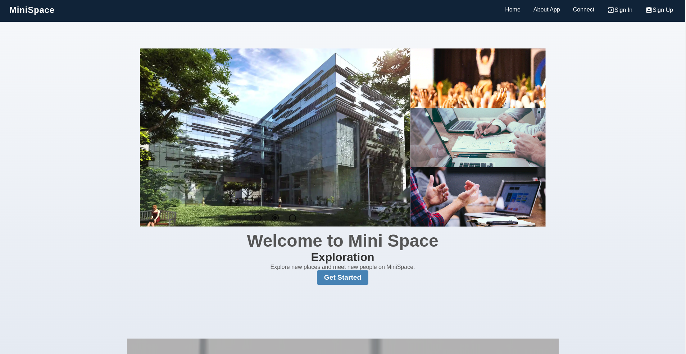
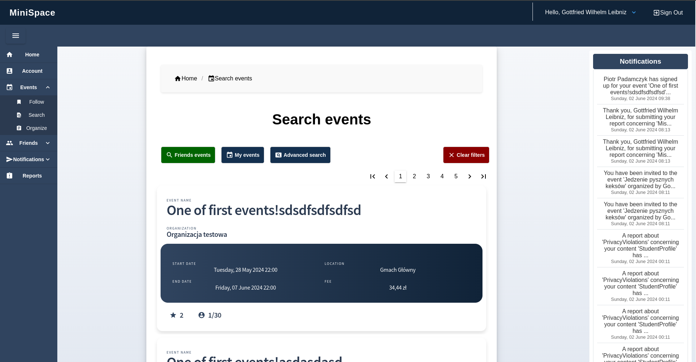

# MiniSpace - Student life activity app

MiniSpace is a multifaceted application designed to enhance student life by providing a robust platform where students can explore, register, and participate in various events. These events range from cultural to educational and social, aiming to enrich the academic community's vibrant life. 

## Features and Functionalities

### For Students
- **Event Interaction**: Students can browse through available events, register to participate, and receive updates and notifications about upcoming activities.
- **Social Interaction**: The platform allows students to connect with friends, share event experiences, and interact through posts and discussions.
- **Administration Interaction**: Students can report issues directly through the app, ensuring a seamless and user-friendly experience.

### For Event Organizers
- **Event Management**: Organizers can create and manage events, including setting details like location, time, and description.
- **Participant Engagement**: Tools to communicate with participants, manage attendance, and gather feedback post-event to improve future events.
- **Data Analysis**: Access to real-time data analytics to monitor event success and participant engagement.

### For Friends and Social Connections
- **Enhanced Event Filters**: Friends can see which events others are attending, making the event choice more social.
- **Invitations**: Ability to send and receive invitations to events, enhancing the social experience.

### For System Administrators
- **User and System Oversight**: Admins have the tools to manage user issues and system functionality, ensuring smooth operation.
- **Content Moderation**: Capabilities to monitor and manage the content to maintain a respectful and constructive community environment.

## Use Cases
- **Events**: From browsing to attending and reviewing events.
- **Social Interactions**: Managing friends lists, sending invitations, and sharing experiences.
- **Administration**: Handling user reports, system updates, and data analysis for continuous improvement.

## Frontend
- [ ] Created with [Blazor](https://dotnet.microsoft.com/en-us/apps/aspnet/web-apps/blazor) - single-page web application framework being a part of the .NET ecosystem
- [ ] Written in C#, can run in the browser by using [Blazor Server](https://dotnet.microsoft.com/en-us/apps/aspnet/web-apps/blazor)

## Backend
- **Framework**: Backend services are built using [Convey](https://github.com/snatch-dev/Convey), a set of libraries optimized for building .NET microservices.
- **Architecture**: Implements a microservice architecture with an emphasis on the CQRS pattern, separating read operations from update operations to enhance performance and scalability.
- **Services**:
  - Identity Service
  - User Service
  - Event Service
  - Reports Service
  - Notifications Service
  - Friend Service
  - Post Service
  - Organizer Service
  - Media Files Service
  - Comments Service
  - Reactions Service
  - Students Service
  - Organizations Service
- **API Gateway**: Utilizes [Ntrada](https://github.com/snatch-dev/Ntrada) for routing and managing requests across multiple services through a single entry point.

## Infrastructure
- [ ] [MongoDB](https://www.mongodb.com/products/platform/cloud) - document-oriented database
- [ ] [Consul](https://www.consul.io) - microservices discovery
- [ ] [RabbitMQ](https://www.rabbitmq.com) - message broker
- [ ] [Fabio](https://github.com/fabiolb/fabio) - load balancing
- [ ] [Jaeger](https://www.jaegertracing.io) - distributed tracing
- [ ] [Grafana](https://grafana.com) - metrics extension
- [ ] [Prometheus](https://prometheus.io) - metrics extension
- [ ] [Seq](https://datalust.co/seq) - logging extension
- [ ] [Vault](https://www.vaultproject.io) - secrets extension

## Code Coverage
Stay informed about the code quality with our integrated Codecov badge that displays the current code coverage percentage:

## Contributing
Contributions are what make the open-source community such an amazing place to learn, inspire, and create. Any contributions you make are **greatly appreciated**.

Please refer to [CONTRIBUTING.md](./CONTRIBUTING.md) for more details.

## License
Distributed under the MIT License. See [LICENSE](./LICENCE) for more information.

## Contact
- Project Link: [https://github.com/SaintAngeLs/distributed_minispace](https://github.com/SaintAngeLs/distributed_minispace)
- Live Demo: [minispace.itsharppro.com](http://minispace.itsharppro.com)

## Contributors
MiniSpace is made possible thanks to the contributions of several individuals. Here is a list of the remarkable people who have contributed to this project:

- **@eggwhat**
- **@an2508374**
- **@SaintAngeLs** 
- **@olegkiprik**
- **@zniwiarzxxx**

Thank you for considering Mini Space for your academic community engagement needs!
